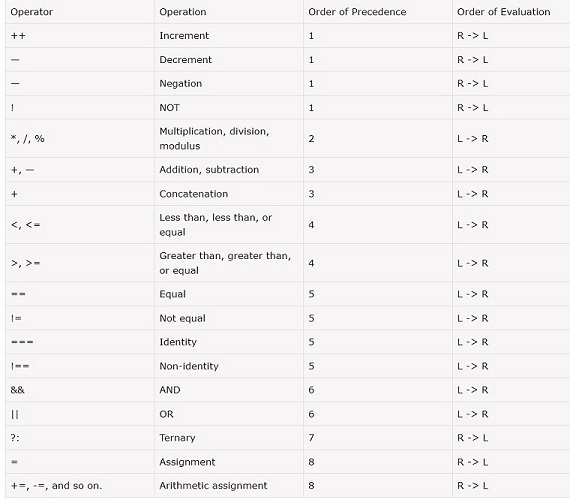

## 1. Name the three ways to declare a variable?
`let const var`
## 2. Which of the three variable declarations should you avoid and why?
`var => Because now there is a better way of declaring variables and even constants… With block scope! You don’t need to think twice when declaring variables inside blocks. It is easier to work with block scope than with function scope. The var usage has been being discouraged.`
## 3. What rules should you follow when naming variables?
- Spaces are not allowed in variable names.
- Only letters, digits, underscores, and dollar signs are permitted in variable names.
- Case matters when it comes to variable names.
- A letter (alphabet), an underscore (_), or a dollar sign ($) must be the first character in a variable name, any other special characters must not be taken.
- certain terms such as reserved words in javascript shouldn’t be used to name variables.
## 4. What should you look out for when using the + operator with numbers and strings?
`They must be the same type`
## 5. How does the % operator work?
`Remainder operator:  It gets us the remainder of the number when we divide the left operand by the right operand. `
## 6. Explain the difference between == and ===.
-  == -> compare the value of the variables
-  === -> compare the both value and type of the variables
## 7. When would you receive a NaN result?
`NaN = Not a Number => The special value NaN shows up in JavaScript when Math functions fail (Math.sqrt (-37)) or when a function trying to parse a number fails or NaN represents a computational error. It is a result of an incorrect or an undefined mathematical operation`
## 8. How do you increment and decrement a number?
`with ++ and --`
## 9. Explain the difference between prefixing and post-fixing increment/decrement operators.
`There is a big difference between postfix and prefix versions of ++.
In the prefix version (i.e., ++i), the value of i is incremented, and the value of the expression is the new value of i.
In the postfix version (i.e., i++), the value of i is incremented, but the value of the expression is the original value of i.`
## 10. What is operator precedence and how is it handled in JS?
`In every language, evaluation of an expression is done based on a predefined order of precedence which helps the language engine to determine which part of the expression will be evaluated first, which will second and so on.`

## 11. How do you log information to the console?
`Type in js file => console.log('My data');`
## 12. What does unary plus operator do to string representations of integers?
- +a // Converts to number
- -a // Converts to number and negates
- ++a // Adds 1 to a and returns new a
- a++ // Adds 1 to a and returns original a
- --a // Subtracts 1 from a and returns new a
- a-- // Subtracts 1 from a and returns original a
## 13. What are the eight data types in JavaScript?
- String
- Number
- Boolean
- Null
- Undefined
- Symbol
- BigInt
- Object
## 14. Which data type is NOT primitive?
`Object is called non-primitive data types in Javascript. This data type is not predefined in Javascript. It is created by programmers.`
## 15. What is the relationship between null and undefined?
`null is an object but undefined is a type- null is an assigned value. It means nothing. undefined means a variable has been declared but not defined yet`
## 16. What is the difference between single, double, and backtick quotes for strings?
## 17. What is the term for embedding variables/expressions in a string?
## 18. Which type of quote lets you embed variables/expressions in a string?
## 19. How do you embed variables/expressions in a string?
## 20. How do you escape characters in a string?
## 21. What is the difference between the slice/substring/substr string methods?
## 22. What are the three logical operators and what do they stand for?
## 23. What are the comparison operators?
## 24. What are truthy and falsy values?
## 25. What are the falsy values in JavaScript?
## 26. What are conditionals?
## 27. What is the syntax for an if/else conditional?
## 28. What is the syntax for a switch statement?
## 29. What is the syntax for a ternary operator?
## 30. What is nesting?
## 31. What are functions useful for?
## 32. How do you invoke a function?
## 33. What are anonymous functions?
## 34. What is function scope?
## 35. What are return values?
## 36. What are arrow functions?